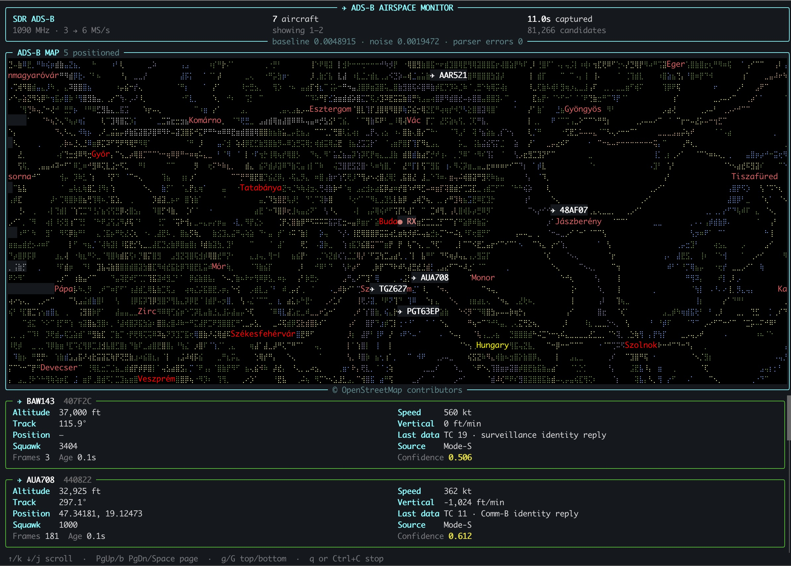

# ADS-B TUI



An ADS-B receiver for the terminal, built around 
[mapscii-py](https://github.com/encse/mapscii-py).

The decoder is known to work with `Airspy Mini` and `RTL-SDR `dongles through
SoapySDR.

## Installation

I recommend using [conda](https://docs.conda.io/projects/conda/en/latest/user-guide/install/index.html) to create a clean and throwaway environment.

```sh
conda create -n adsb -c conda-forge python=3.13
conda activate adsb
python3 -m pip install -r requirements.txt
```

for `Airspy Mini`:

```sh
conda install -c conda-forge airspy soapysdr-module-airspy
```

for `RTL-SDR`

```sh
conda install -c conda-forge rtl-sdr soapysdr-module-rtlsdr
```

## Usage
Connect your SDR to your computer. Use an antenna appropriate for 1090Mhz. For the RTL-SDR antenna kit: use the shorter antenna fully retracted. It should be about 6cm long on each side.

```sh
python3 adsb_tui.py
```

At startup, the program tries the supported SoapySDR drivers in order and
uses the first one that reports a connected device. To select a driver
explicitly instead:

```sh
python3 adsb_tui.py airspy
python3 adsb_tui.py rtlsdr 
```

The Airspy profile tunes to 1090 MHz, samples at 3 MS/s, and sets the LNA,
mixer, and VGA gains to 14.

The RTL-SDR profile tunes to 1090 MHz, samples at 2 MS/s, and sets the tuner
gain to 40 dB.

## Keyboard controls

- `m`: show or hide the map
- `l`: show or hide the aircraft list
- `g`: open or close the SDR gain dialog
- `j`/`k` or arrow keys: scroll the aircraft list
- `q`: quit

In the gain dialog, use up/down to select a gain stage and left/right (or
`-`/`+`) to adjust it. The available stages, limits, and step sizes come from
the connected device, so Airspy and RTL-SDR expose their own controls.

When only the map or the aircraft list is visible, it uses the available
terminal space.

## Receiver position and map

Set the receiver position with `--receiver-lat` and `--receiver-lon`:

```sh
python3 adsb_tui.py \
    --receiver-lat 47.4979 \
    --receiver-lon 19.0402 \
    airspy
```
